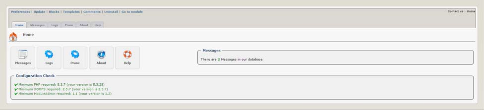
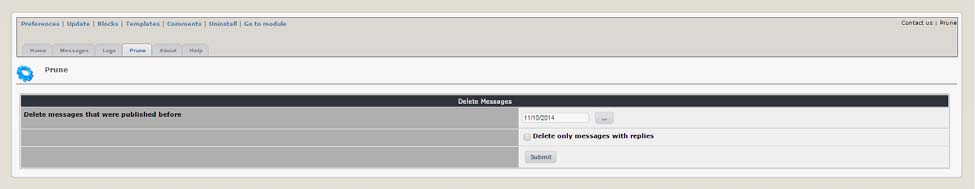
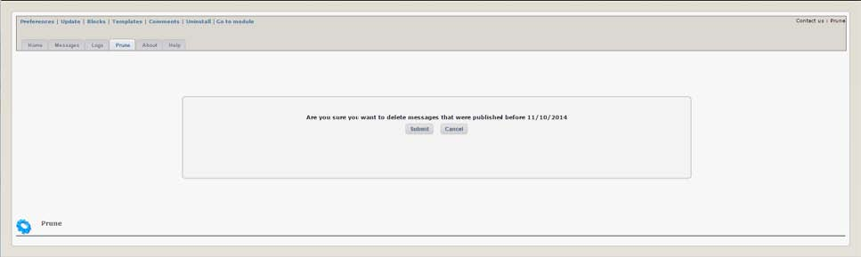
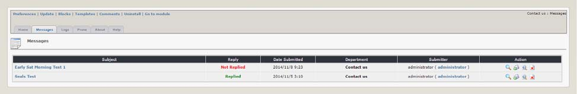
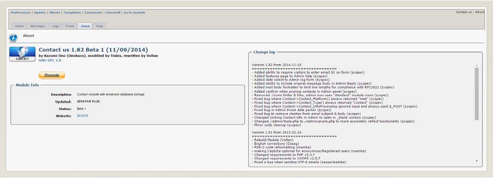
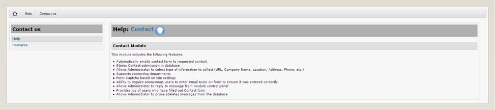

# 2.0 Administration Menu

There are seven (7) menu options on top.  These can be seen in the graphic below above the Module’s Administration tabs.  The menu options available are described in the table below.

|Option|	Action|
|--|--|
|Preferences|	Here you can configure your preferences for the module|
|Update|	Click here if you’ve made some changes to the module, uploaded new files, etc. – this will recompile the module and update all entries in the database |
|Blocks|	When you click here, it will redirect you to the Blocks section of XOOPS, and select the blocks related to your module|
|Templates|	Here you can modify the standard module templates using the XOOPS Template manager|
|Comments|	This module does not support Comments so the link takes you the XOOPS Comment manager|
|Uninstall	|Links to the module uninstall option, the same as clicking the “red arrow” on the module administration page|
|Go to module|	If the module is visible on the user side, this will take you there|

**Home Tab**

The module’s home screen displays links to the administration functions and also provides information on the system configuration check results.  The module verifies the XOOPS installation meets the minimum requirement to ensure the module operates correctly.

The home screen also displays the current number of messages stored in the database.

 
*Figure 4 The “Module Home” Tab*

There are six (6) Tabs in the Administration of the XOOPS Partners module: 
-	Home Tab – displays relevant module information (shown in the previous graphic)
-	Messages Tab – allows management of Contact messages
-	Log Tab – allows viewing various message logs
-	Prune Tab – allows deleting messages from the database
-	About - information about the module, its authors, and changelog
-	Help - provides additional help for the user

**Prune Tab**

 
*Figure 7 The Prune Tab*

The prune page provides the administrator the ability to prune (delete) messages in the database. There is a selection to select the date used for the deletion – this means only messages before this date will be removed.  Warning:  Once this action is completed (via confirmation on the following page) the messages will be removed from the database and no longer available.

  
*Figure 8 The “Prune Confirm” Page*

This page is displayed after an administrator chooses to delete a range of logs.  Once this form is submitted the deletion will occur and is unrecoverable. The administrator can select ‘Cancel’ to return to module administration without pruning (deleting) the messages.

-	About Tab – provides version, developer information, also displays the module change log
-	Help Tab – a brief description of steps necessary to install/uninstall and configure the module

**Messages Tab**
  
*Figure 5 The “Messages” Tab*

The messages page (shown in the graphic above) displays useful information about the messages received. The subject of the message along with the date submitted, if the administrator has sent a reply, the Department (if enabled) the message was sent to, submitter information and also an action panel for each message.
Action Panel

The action panel consists of four (4) action icons.  Clicking the icon will take you to the appropriate location to complete each action.
 

 

- Delete – Delete this message from the database
- View – view the complete message and header information (subject, to/from, etc)
- Reply – create a reply for this message
- Preview – Quickly preview the message in a javascript popup window

 
**Log Tab**
 
*Figure 6 The “Logs” Tab*

The log page provides the administrator the ability to display log information for messages in the database.  There is a selection for the field used for the selection – this means only messages with this field completed will be included in the message log.  The administrator may also choose to limit the display logs for dates prior to the selected date.  Note: Only fields activated in module Preferences will be shown in the available selection box.  Some fields (location, phone and address) are never included in the selection box.

**Prune Tab**

 
*Figure 7 The Prune Tab*

The prune page provides the administrator the ability to prune (delete) messages in the database. There is a selection to select the date used for the deletion – this means only messages before this date will be removed.  Warning:  Once this action is completed (via confirmation on the following page) the messages will be removed from the database and no longer available.

  
*Figure 8 The “Prune Confirm” Page*
This page is displayed after an administrator chooses to delete a range of logs.  Once this form is submitted the deletion will occur and is unrecoverable. The administrator can select ‘Cancel’ to return to module administration without pruning (deleting) the messages.

**About Tab**

  
*Figure 9 The “About” Tab*

The about page provides useful module information.  The page shows detailed information about the module version, the date it was installed in this XOOPS installation, a detailed log of the changes made to the module.  Also included is a donation link.  Please, if you find this module useful, donate something to help continue it’s development.

**Help Tab**

  
*Figure 10 The “Help” Tab*

The help section consists of two (2) pages. The first page (“Help”) gives a description, general module install/uninstall information as well as some operating instructions.  There is also a link to this document in the event you need to reference it in the future.

  
*Figure 11 The “Help - Features” Page*

 
