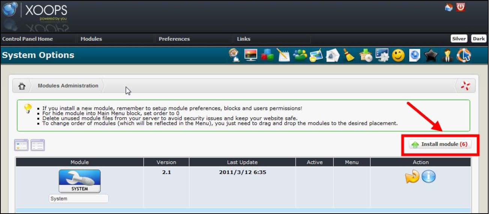

# 1.0 Install/Uninstall

No special measures necessary, follow the standard installation process – extract the module folder into the /modules directory. Install the module through Admin -> Modules -> Install Modules (see below). 

