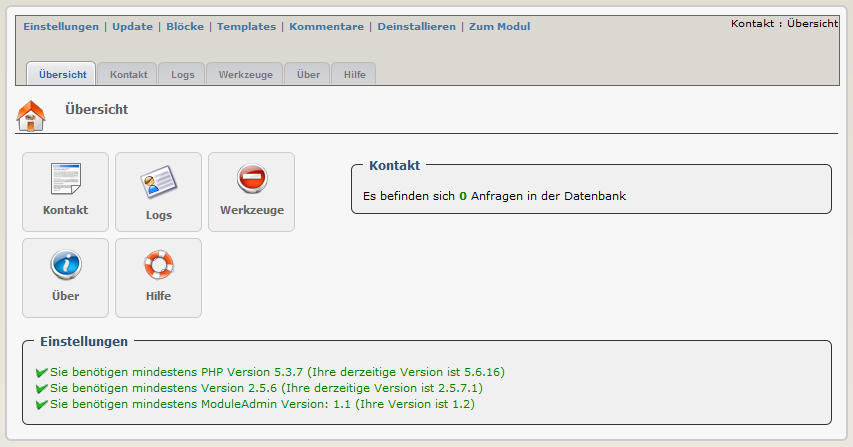

### _XOOPS Documentation Series_

# Modul: Contact Us  2.23
#### for XOOPS 2.5.7
      

 
## Bedienungsanleitung
  
© 2015 The XOOPS Project (www.xoops.org)    
  

## Basisinformation zum Modul 
 
“Contact Us” ist ein sehr einfaches Modul. Es bietet ihnen die Möglichkeit, dass Benutzer an eine definierte EMail-Adresse oder eine Abteilung ein Kontakt-EMail senden.
Der Aufruf des Kontaktformulars erfolgt über das Hauptmenü oder es können auch entsprechende Blöcke angezeigt werden.
 

*Abbildung 1: Hauptübersicht des Kontaktmoduls (Administrationsbereich)*

# Inhaltstabelle

* [Einleitung](README.md)
* [(De-)Installation](book/1install.md)
* [Administrationsbereich](book/2administration.md)
* [Einstellungen](book/3preferences.md)
* [Benutzerbereich](book/5userside.md)
* [Blöcke](book/6blocks.md)
* [Templates](book/7templates.md)
* [Support durch das Modul "Waiting"](book/8waiting.md)
* [Modul Credits](book/9credits.md)
* [About Xoops](book/10aboutxoops.md)
