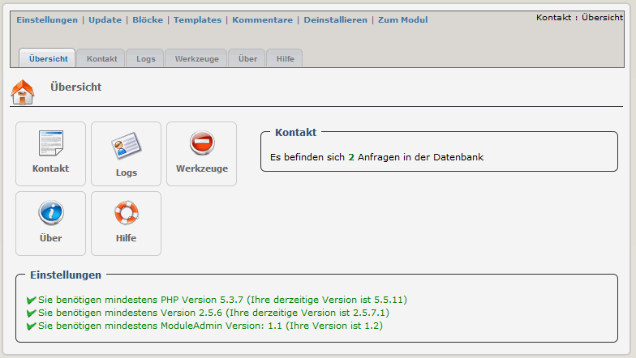

### _XOOPS Documentation Series_

# Modul: Contact Us  2.25
#### für XOOPS 2.5.7+
#### für PHP 5.5, 5.6 an 7.0
      

 
## Bedienungsanleitung
  
© 2015 The XOOPS Project (www.xoops.org)    
  

## Basisinformation zum Modul 
 
“Contact Us” ist ein sehr einfaches Modul. Es bietet ihnen die Möglichkeit, dass Benutzer an eine definierte EMail-Adresse oder eine Abteilung ein Kontakt-EMail senden.
Der Aufruf des Kontaktformulars erfolgt über das Hauptmenü oder es können auch entsprechende Blöcke angezeigt werden.
 

*Abbildung: Hauptübersicht des Kontaktmoduls (Administrationsbereich)*

## Das Modul herunterladen/forken 
 

**Sie können das Modul --> [hier](https://github.com/XoopsModules25x/contact) forken** 

## Wie können Sie mithelfen

[Sie können auf GitHub mitarbeiten](https://github.com/XoopsDocs/contact-tutorial). Änderungen werden [automatisch nach Gitbook.io übertragen](https://www.gitbook.com/book/xoops/contact-tutorial/activity), wenn sich das [Hauptverzeichnis](https://github.com/XoopsDocs/contact-tutorial) ändert.

Eine Bearbeitung der Bedienungsanleitung kann entweder durch eine Direkteingabe in die Markdown-Dateien mit Hilfe eines Texteditors erfolgen, oder Sie öffnen das entsprechende Verzeichnis mit [der Gitbook Desktop App](https://github.com/GitbookIO/editor/blob/master/README.md). Diese Desktop-App bietet auch eine Direktvorschau.

# Inhaltstabelle

* [Einleitung](README.md)
* [(De-)Installation](book/1install.md)
* [Administrationsbereich](book/2administration.md)
* [Einstellungen](book/3preferences.md)
* [Benutzerbereich](book/5userside.md)
* [Blöcke](book/6blocks.md)
* [Templates](book/7templates.md)
* [Support durch das Modul "Waiting"](book/8waiting.md)
* [Modul Credits](book/9credits.md)
* [About Xoops](book/10aboutxoops.md)

## Lizenzbestimmungen:

 Sofern nicht anders angegeben, fällt dieser Inhalt unter die Lizenzbestimmungen <a rel="license" href="http://creativecommons.org/licenses/by-nc-sa/4.0/">Creative Commons Attribution-NonCommercial-ShareAlike 4.0 International License</a>.

Alle Derivate sind Teil von XOOPS Project <a rel="xoops" href="http://www.xoops.org">www.xoops.org</a>

##Bedienungsanleitung Version: 1.1
