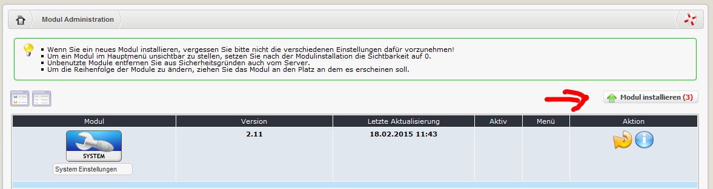
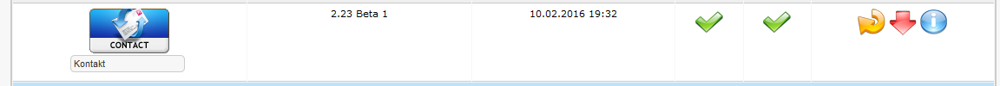

# 1.0 Installation/Deinstallation

Es sind keine speziellen Maßnahmen erforderlich, führen Sie den Standardinstallationsprozess aus.
Wenn Sie zustätzliche Informationen benötigen, lesen Sie die Installationshinweise unter [XOOPS Operations Manual](http://goo.gl/adT2i).

#### Installation
- Extrahieren Sie den Ordner 'contact' in das Module-Verzeichnis
- Loggen sie sich als Administrator und wechseln sie zur Xoops Administrationseite
- Installieren Sie das Modul über Administration -> Module

*Abbildung 2 Die Moduladministration und Installation*
- Konfigurieren sie das Modul 
- Die nächsten Schritte sind nun die Rechteverwaltung des Modules und der Blöcke in System --> Gruppen.

#### Deinstallation
Zur Deinstallation klicken sie einfach auf den roten Pfeil

*Abbildung 3 Deinstallation in der Moduladministration*
