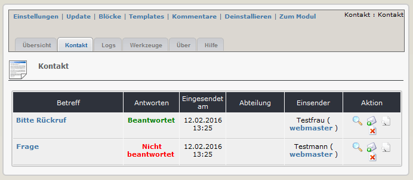
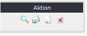
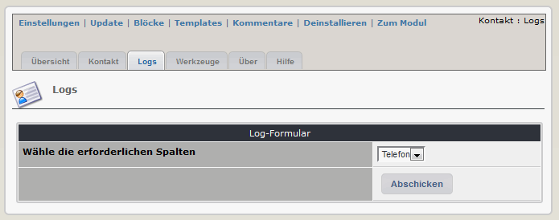
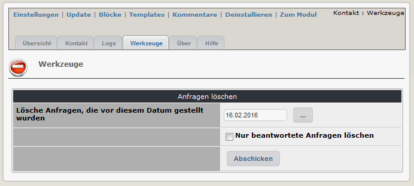
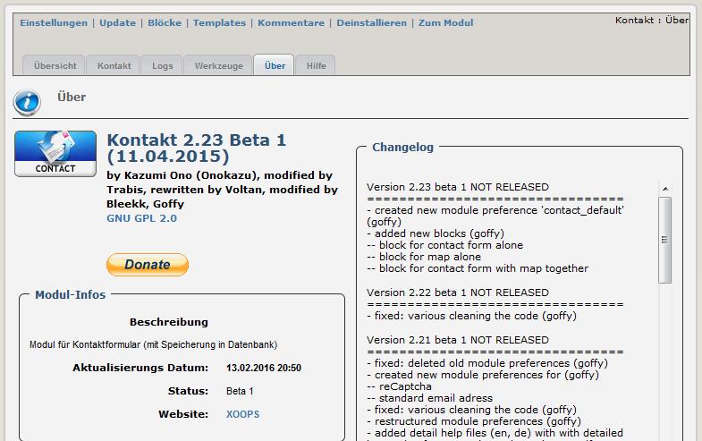
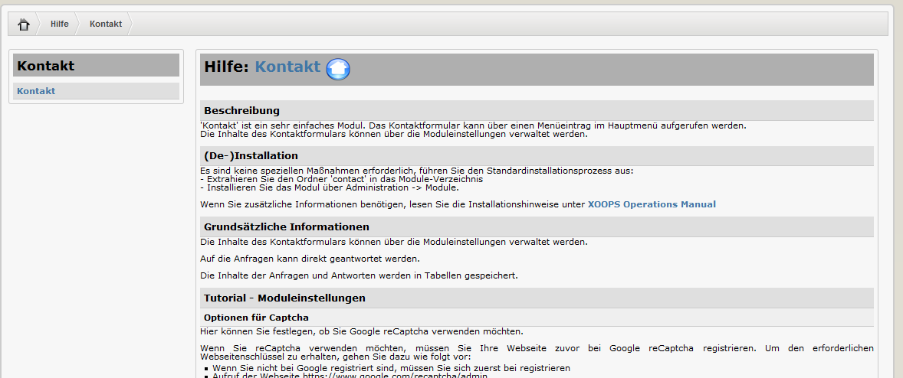

# 2. Administrationbereich

Im oberen Bereich befinden sich 7 Menüpunkte.

|Menüpunkt|	Funktion|
|---|---|
|Einstellungen| Hier können sie die Moduleinstellungen vornehmen |
|Update| Klicken sie hier, wenn sie einige Änderungen am Modul vorgenommen haben, Dateien hochgeladen haben usw. - dadurch wird das Modul neu kompiliert und alle Datenbankeinträge werden erneuert |
|Blöcke| Wenn sie hier klicken, werden sie zur Blockverwaltung weitergeleitet, und es werden die Blöcke des aktuelle Modules vorgefiltert |
|Templates| Hier können sie die Standardtemplates des aktuellen Moduls bearbeiten, verwendet wird dabei der XOOPS Template Manager |
|Kommentare| Dieses Modul unterstützt keine Kommentare, sodass sie zum Xoops Kommentar-Manager weitergeleitet werden |
|Deinstallieren| Sie werden zur Deinstallation des Moduls weitergeleitet |
|Zum Modul| Wenn das Modul auf der Benutzerseite sichtbar ist, werden sie dorthin weitergeleitet |

Es befinden sich außerdem 6 Registerblätter im Administrationsbereich: 
* Register Übersicht – grundsätzliche Informationen zu Modul
* Register Kontakt – ermöglicht die Verwaltung der Kontaktnachrichten
* Register Logs – ermöglicht die Anzeiger verschiedener Logs
* Register Werkzeuge – ermöglicht des Löschen von Nachrichten aus der Datenbank
* Register Über - Information über da Modul, die Autoren und das Changelog
* Register Hilfe - bietet grundsätzliche Hilfe für den Anwender

#### 2.1 Register Übersicht
Die Modulübersicht bietet Links zu den Administrationsfunktionen und zeigt Informationen über die Ergebnisse des Systemkonfigurationschecks. Das Modul überprüft die Xoops-Installation sowie die Minimalanforderungen, um sicherzustellen, dass das Modul einwandfrei arbeitet.

Die Übersicht zeigt aber auch die aktuelle Anzahl der in der Datenbank gespeicherten Nachrichten.

 
*Abbildung: Die Hauptübersicht*

#### 2.2 Register Kontakt
  
*Abbildung: Das Registerblatt Kontakt*

Diese Seite zeigt nützliche Informationen über die erhaltenen Kontaktanfragen. Der Betreff und daneben das Antwortdatum (sofern bereits geantwortet wurde), sowie die Abteilung (falls diese Option verwendet wird), an welche die Mail weitergeleitet wurde. Zusätzlich findet man Infos über den Einsender.

Spalte "Aktionen"
  

Der Aktionsbereich bietet 4 Aktionen:
* Löschen – Löschen der Nachricht aus der Datenbank
* Zeige – Zeigt die vollständige Nachricht mit den Header-Informationen (betreff, von/an, etc)
* Antworten – erstellt eine Antwort auf diese Nachricht
* Vorschau – schnelle Vorschau der Nachricht in einem Javascript Popup-Fenster

#### 2.3 Register Logs
  
*Abbildung 6 Das Register “Logs”*

Diese Seite bietet dem Administrator die Möglichkeit, die Informationen aus der Datenbank nach verschiedenen Kriterien zu filtern. Ein Dropdown mit den möglichen Felder wird angeboten, wobei bei der Anzeige des Ergebnisses nur Nachrichten angezeigt werden, bei denen das entsprechende Feld auch befüllt wurde. Bei einer großen Anzahl an Einträgen kann zusätzlich ein Datum als Limit angegeben werden.

#### 2.4 Register Werkzeuge
  
*Abbildung 7 Das Register Werkzeuge*

Dieses Register bietet dem Administrator die Möglichkeit, Nachrichten aus der Datenbank zu löschen. Dabei kann festgelegt werden, dass alle Nachrichten vor einem bestimmten Datum gelöscht werden, zusätzlich kann festgelegt werden, ob alle oder nur beantwortete Nachrichten gelöscht werden.
Achtung: Sobald diese Aktion vollständig durchgeführt ist, sind die Nachrichten aus der Datenbank gelöscht und nicht mehr verfügbar.

#### 2.5 Register Über
  
*Abbildung 8 Das Register Über*

Diese Seite bietet nützliche Informationen, darunter Infos über die Modulversion, das Datum der Installation sowie ein detailliertes Changelog.
Außerdem befindet sich hier auch ein Spendenlink, Wenn ihnen das Modul gefällt, dann Spenden sie für die Weiterentwicklung dieses Moduls.

#### 2.6 Register Hilfe
  
*Abbildung 9 Das Register Hilfe*

Auf dem Registerblatt Hilfe finden sie auch eine kurze Beschreibung dieses Moduls. 
