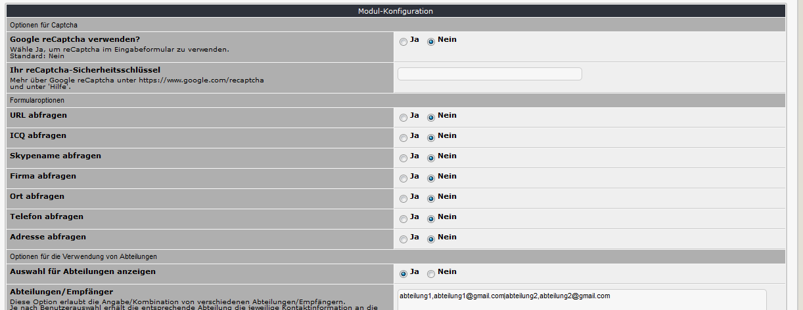
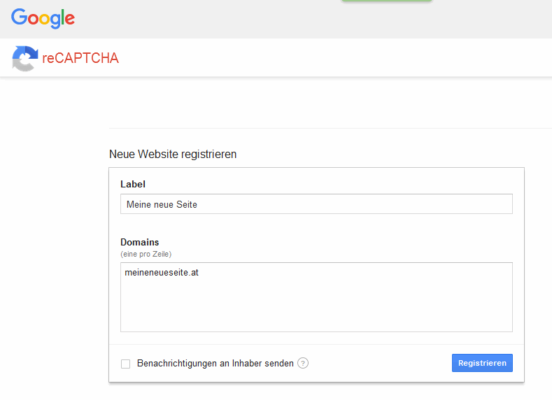
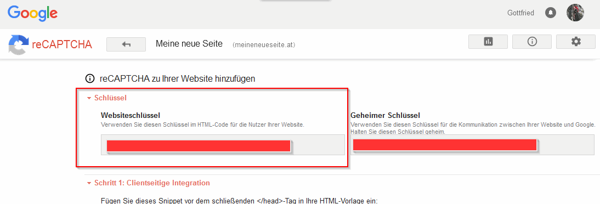
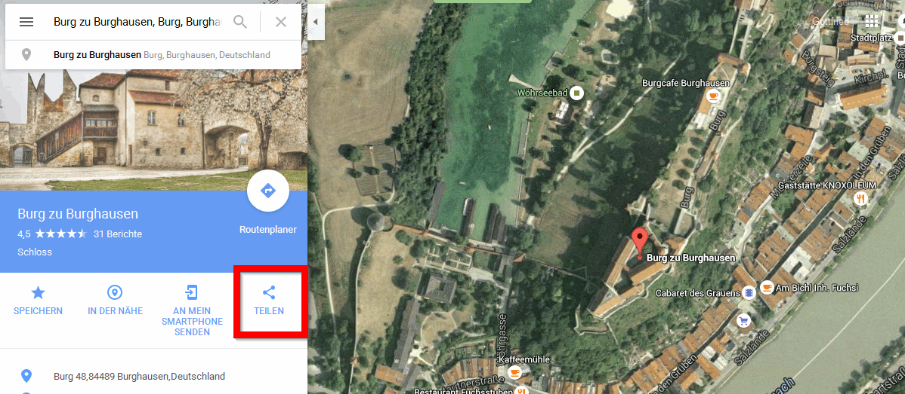
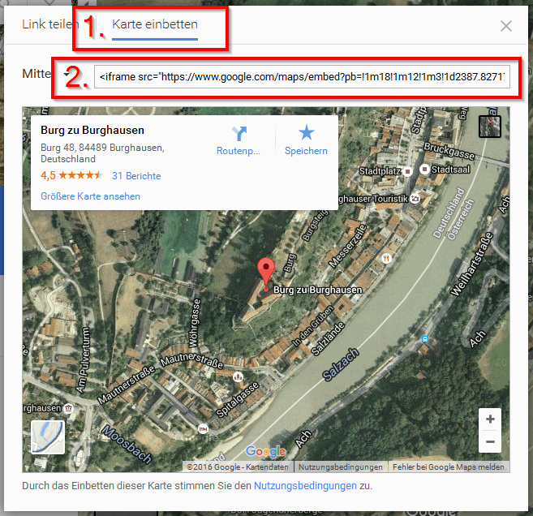

# 3. Moduleinstellungen

*Abbildung: Moduleinstellungen*

### 3.1 Optionen für Captcha
#### 3.1.1 Google reCaptcha verwenden?
Wähle Ja, um Google reCaptcha im Eingabeformular zu verwenden.

#### 3.1.2 Ihr reCaptcha-Sicherheitsschlüssel
Bitte hier ihren reCaptcha-Sicherheitsschlüssel angeben

Wenn Sie reCaptcha verwenden möchten, müssen Sie Ihre Webseite zuvor bei Google reCaptcha registrieren. Um den erforderlichen Webseitenschlüssel zu erhalten, gehen Sie dazu wie folgt vor:
* Wenn Sie nicht bei Google registriert sind, müssen Sie sich zuerst bei registrieren
* Aufruf der Webseite https://www.google.com/recaptcha/admin
* Einfach die gewünschte Webseite (Bezeichnung und Url) angeben:

* Nach dem Klick auf "Registrieren" erscheint eine neue Seite mit dem erforderlichen Webseitenschlüssel:

* Den Webseitenschlüssel kopieren und in der Moduleinstellung eintragen
* fertig

Mehr über Google reCaptcha unter https://www.google.com/recaptcha

### 3.2 Formularoptionen
Hier können sie festlegen, welche Felder im Kontaktformular angezeigt werden sollen.

### 3.3 Optionen für die Verwendung von Abteilungen
#### 3.3.1 Auswahl für Abteilungen anzeigen
Hier können sie festlegen, ob sie diese Option grundsätzlich verwenden wollen. Die nachfolgenden Optionen müssen dann befüllt werden.

#### 3.3.2 Abteilungen/Empfänger
Diese Option erlaubt die Angabe/Kombination von verschiedenen Abteilungen/Empfängern.
Je nach Benutzerauswahl erhält die entsprechende Abteilung die jeweilige Kontaktinformation an die dafür definierte E-Mail-Adresse.

Definiere jede Abteilung/E-Mail wie folgt:

Verkauf,maxmustermann@mydomain.com|Kundendienst,susisorglos@mydomain.com|Buchhaltung,fritzrechner@mydomain.com etc. - jede Abteilung muss von der E-Mail mit einem Beistrich ',' getrennt sein,
und jede Kombination Abteilung/E-Mail muss durch einen Strich '|' getrennt sein.

Wenn eine Nachricht an 2 EMails weitergeleitet werden soll, dann wiederholen sie die Abteilung, z.B. Kundendienst,maxmustermann@mydomain.com|Kundendienst,susisorglos@mydomain.com|

Wenn keine Abteilung/kein Empfänger angegeben wird, wird die Mailnachricht an die Standard-E-Mail-Adresse versendet.

#### 3.3.3 Abteilung als Präfix verwenden?
Wenn ja, dann wird der Name der Abteilung als Präfix im E-Mail-Betreff verwendet.
Diese Option wird nur verwendet, wenn Abteilungen definiert wurden.

#### 3.3.4 Zusatz Präfix Email-Betreff
Definieren sie den Text, der als Präfix Abteilung im E-Mail-Betreff verwendet wird. Wenn Sie z.B. 'Kontaktanfrage' eingeben, erhalten Sie '[Kontaktanfrage Kundendienst]: Originaltext Betreff'.
Diese Option wird nur verwendet, wenn Abteilungen definiert wurden.

### 3.4 Information
#### 3.4.1 Überschrift des Kontaktformulars
Hier können sie festlegen, welcher Text im Kopfbereich des Kontaktformulars angezeigt werden soll. Dabei ist auch HTML-Code zulässig.

#### 3.4.2 Standard-Kontaktdaten
Hier können die Kontaktdaten angegeben werden, die zusätzlich zum Formular angezeigt werden sollen (z.B. Name, Adresse , Telefonnummer,...

#### 3.4.3 Google Maps einbetten
Hier können sie Google Maps als iframe einbetten

Gehen Sie dazu wie folgt vor:
- Den entsprechenden Ort in Google Maps suchen
- Auf "Einstellungen" oder "Teilen" klicken:

- Nach dem Klick auf "Karte teilen oder einbetten" den Tab "Karte einbetten" wählen:

- Den iframe-Code kopieren und in der Moduleinstellung eintragen
- Falls erforderlich, die Einstellung der Weite des iframes auf 100 % ändern.
- fertig

### 3.5 Sonstige Optionen
#### 3.5.1 Standardempfänger
Definieren sie, an welche E-Mail-Adresse jede Kontaktanfrage per Mail gesendet wird.

#### 3.5.2 Bestätigungsmail senden?
Wenn sie ja wählen, wird an die im Kontaktformular angegebene E-Mail-Adresse eine kurze Bestätigungsmail mit den wichtigsten Informationen gesendet.

### 3.6 Administration
#### 3.6.1 Anfragen pro Seite
Definieren sie die Anzahl der Einträge für die Liste der Anfragen (Administrationsbereich)
