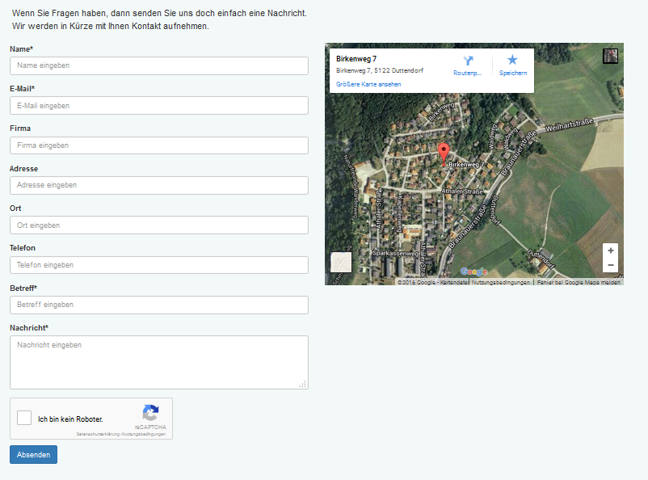
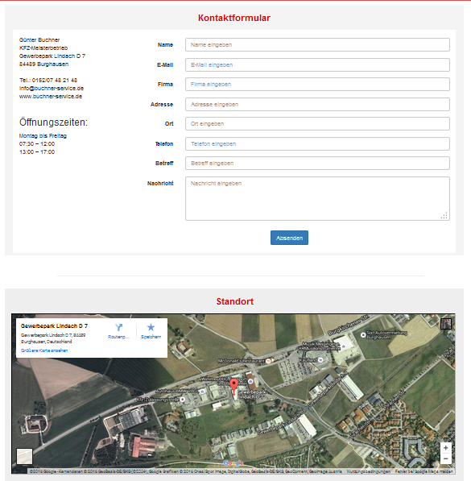

# 5. Die Benutzerseite

Auf der Benutzerseite kann das Kontaktformular entweder über einen Link im Hauptmenü aufgerufen werden oder es wird als Block angeboten.
Es ist einfach nur der gewünschte Text im Feld "Nachricht" einzugeben, mit einem Klick auf "Senden" werden die Daten gesendet.
Wenn der Benutzer eingeloggt ist, werden die Daten des eigenen Profils/Kontos automatisch übernommen, bei Gast-Anwendern müssen diese Informationen manuell ergänzt werden.
Die Überschrift des Kontaktformulars (siehe [Moduleinstellungen](3preferences.md)) befindet sich oberhalb des Eingabeformulars. Die Standard-Kontaktdaten (siehe [Moduleinstellungen](3preferences.md)) werden links vom Kontaktformular angezeigt.

*Abbildung Kontaktformular auf Benutzerseite*

Werden für die Anzeige des Kontaktformulares die Blöcke verwendet, so kann zwischen folgenden Blöcken gewählt werden:
* nur Kontaktformular
* nur Google-Maps
* Kontaktformular zusammen mit Google-Maps

*Abbildung Kontaktformular und Maps als einzelne Blöcke (untereinander) auf Benutzerseite*
Weitere Infos siehe [Blöcke](6blocks.md)