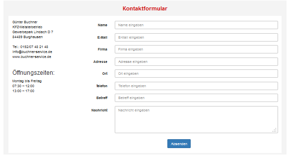
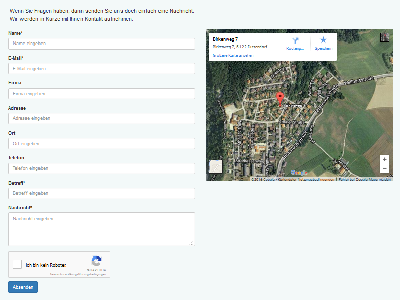

# 6.0 Blöcke

"Contact Us" bietet folgende Blöcke:

**nur Kontaktformular**
Mit diesem Block wird nur ein Kontaktformular angezeigt. Die Überschrift des Kontaktformulars (siehe [Moduleinstellungen](3preferences.md)) befindet sich oberhalb des Eingabeformulars. Die Standard-Kontaktdaten (siehe [Moduleinstellungen](3preferences.md)) werden links vom Kontaktformular angezeigt.
 

**nur Google-Maps**
Sofern die Daten für ein Google-Maps-iframe erfasst wurden (siehe [Moduleinstellungen](3preferences.md)), wird mit diesem Block der angegebene Standord in einer Karte angezeigt.
 

**Kontaktformular zusammen mit Google-Maps**
Mit diesem Block wird sowohl ein Kontaktformular als auch eine Google-Maps-Karte angezeigt. Die Karte befindet sich rechts neben dem Kontaktformular.
 