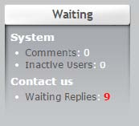

# 8. Support des Moduls Waiting

Das Modul Contact beinhaltet die grndsätzliche Unterstützung des Moduls "Waiting module v0.97+". Der Support erfolgt automatisch und das Modul Contact wird im Block "Waiting" angezeigt:

Das Modul "Waiting" ist unter XOOPS auf http://www.xoops.org verfügbar.
Das Modul Contact stellt dem Modul Waiting Infos über die noch nicht bearbeiteten Nachrichten zur Verfügung, sodass der Administrator sofort die wesentlichen Infos erhält.

**Beachte:** *Das Modul Waiting ist nicht das Gleiche wie der Xoops-Core-Block “Waiting Contents”. The XOOPS core “Waiting Contents” block is not extensible and so contents from the Contact module will not be visible in this block.*
