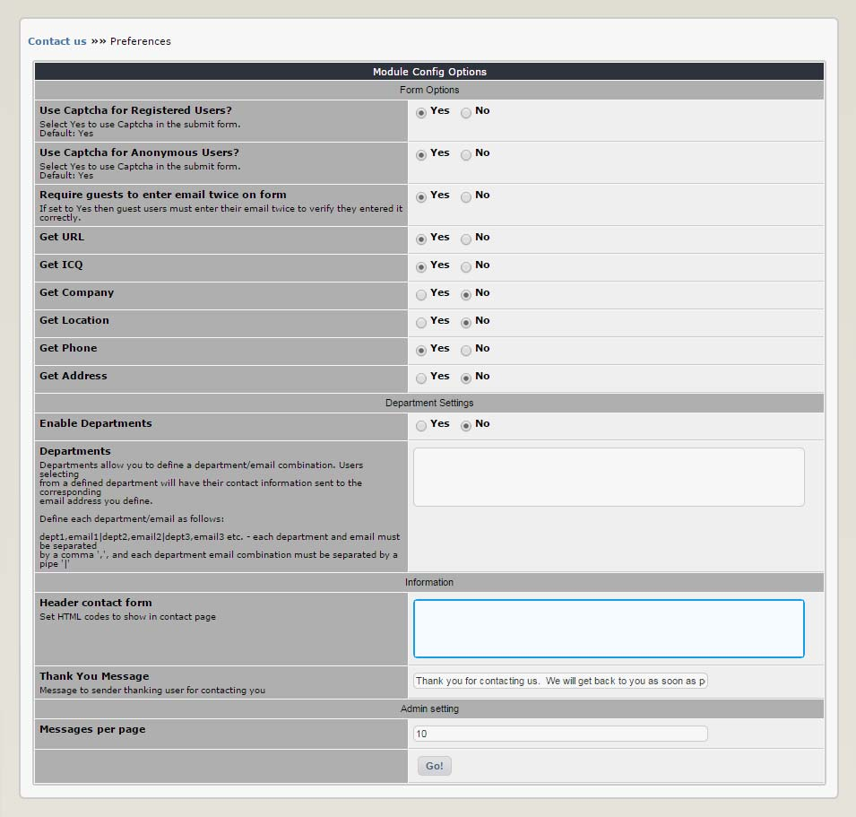

# 3.0 Preferences

You can set options for the module in module Preferences, similar to other XOOPS modules. Many of the options allow you to select the elements of the form that will be visible to the user. The Preference options are pretty well self-explanatory.
### Departments

**Entry Format/Syntax**

Pay close attention if you enable Departments to make sure you enter the required information in the proper format.  For example to include two (2) departments called ‘Sales’ and ‘Support’ and have the message sent to ‘sales@mycompany.com’ and ‘support@mycompany.com’ respectively you would enter ‘Sales,sales@mycompany.com|Support,support@mycompany.com’ (without the single quotes) in the Departments field. Enable using departments by selecting ‘Yes’ in the ‘Enable Departments’ field.

**Multiple Emails per Department**

Entering more than one contact per department is now possible, as of version 1.82. To use this feature just enter each email separately but using the same department name.  For example: ‘Sales,johndoe@mycompany.com|Sales,marysmith@yourcompany.com’.  When the user selects to send a message to the ‘Sales’ department on the form the email will be sent to both johndoe@mycompany.com and marysmith@yourcompany.com’.

*Figure 12 The Preferences Options*