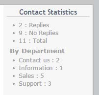

# 6.0 Blocks

As of version 1.82 there is a single block for this module.

**Statistics Block**

The statistics block shows the number of messages (contacts) that have replies, those that have no replies and the total number of messages. If Departments are enabled the block will also show the total number of messages for each department. Only departments with messages will be displayed.  

 

**NOTE:**  A default department (“Contact us”) is created if the module was initially configured without departments enabled, and then subsequently enabled. Messages sent before departments were enabled will be displayed in the Contact us “department”.