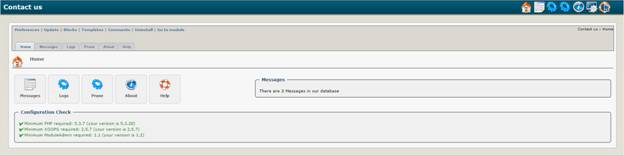

### _XOOPS Documentation Series_

# Module: Contact Us  1.8.2
#### for XOOPS 2.5.7
  
      

            
                
                
    
## User Manual
  
  
  
  
  
© 2014 The XOOPS Project (www.xoops.org)    
  

## Module Purpose 

 
“Contact Us” is a very simple module. It provides a Main Menu link to a contact form that visitors can use to email the website Administrator or optionally a department.

 

*Figure 1: Main view of the Contact Module (Admin side)*

# Table of Content

* [Introduction](README.md)
* [Install/Uninstall](en/1install.md)
* [Administration Menu](en/2administration.md)
* [Preferences](en/3preferences.md)
* [The User Side](en/5userside.md)
* [Blocks](en/6blocks.md)
* [Templates](en/7templates.md)
* [Waiting Module Support](en/8waiting.md)
* [Module Credits](en/9credits.md)
