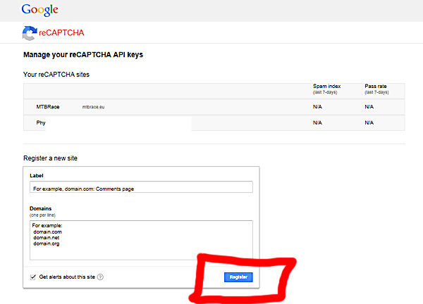
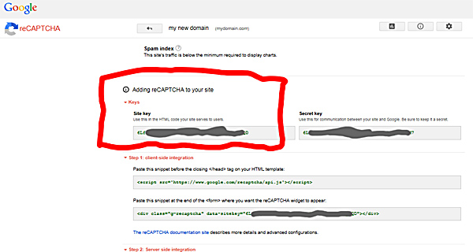
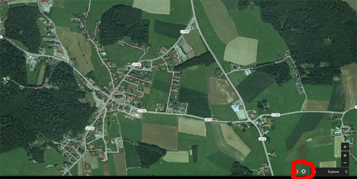
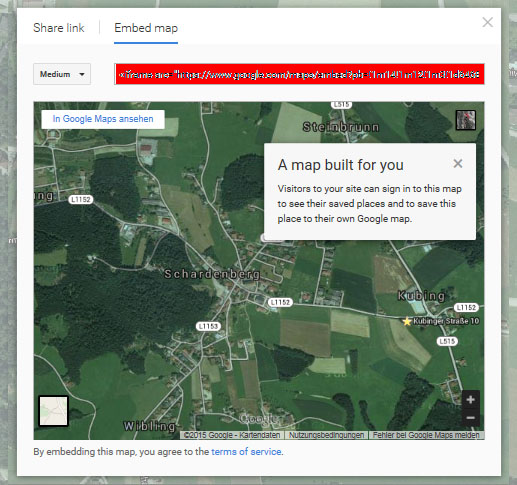

# 3.0 Preferences

*Figure: The Preferences Options*

### 3.1 Options for Captcha
#### 3.1.1 Use Google reCaptcha?
Please decide, whether you want use Google reCaptcha in the contact form or not.

#### 3.1.2 Your reCaptcha-Site-Key
Please enter your reCaptcha-Site-Key

If you want to use reCaptcha, you have to register your website at Google first. In order to get the necessary website-key, do following steps:

* If you are not registered at Google, you have to register yourself first
* Goto website https://www.google.com/recaptcha/admin
* Simply enter your corresponding website (label and domain):

* After clicking on "Register" you get a new site with the required website-key:

* Copy the website-key and paste it to module preferences
* Done

More about Google reCaptcha under https://www.google.com/recaptcha.

### 3.2 Form options
Here you can define, which additional fields you want provide in your contact form.

### 3.3 Options for usage of departments/recipients
#### 3.3.1 Display dropdown for departments
Here you can basically define, whether you want to use several departments. If yes, you have also to fill in the following options.

#### 3.3.2 Departments/recipients
This option will be only used, if the option "Show select Departments" is set "yes".
This option allow you to define a department/email combination.
Users selecting from a defined department will have their contact information sent to the corresponding email address you define.

Define each department/email as follows:
"Sales,johndoe@mycompany.com|Storage,marysmith@mycompany.com|Bookkeeping,jackwest@mycompany.com" etc. - each department and email must be separated by a comma ',', and each department email combination must be separated by a pipe '|'

Entering more than one contact per department is also possible. To use this feature just enter each email separately but using the same department name.  For example: ‘Sales,johndoe@mycompany.com|Sales,marysmith@yourcompany.com’.  When the user selects to send a message to the ‘Sales’ department on the form the email will be sent to both johndoe@mycompany.com and marysmith@yourcompany.com’.

If no department/recipient is defined, then the mail will be sent to standard email address.

#### 3.3.3 Add Department as Prefix?
With this option you can define, that the selected department will be used before the subject text, given by the contacting person.
This will also only used, if the option "Show select Departments" is set "yes".

#### 3.3.4 Additional Email's Subject Prefix
Here you can define the additional text for 'Add Department as Prefix'. If you enter e.g. 'Contact' you will get '[Contact dept1]: Subject text original'.. 
This will also only used, if the option "Show select Departments" is set "yes".

### 3.4 Information
#### 3.4.1 Header contact form
You can enter a welcome text for your contact form, which will be shown on the top of the form. Usage of HTML-code is allowed.

#### 3.4.2 Default contact info
Here you can define additional information, which should be shown beside contact form (e.g name, address , phone number,...)

#### 3.4.3 Embed Google Maps
With this option you can add your location with Google Maps as iframe.

To get the correct iframe-code, do following steps:
* Search the location in google maps
* Click on "Settings":

* After click on "Share or embed map" select tab "Embed map":

* Copy the iframe-Code and paste it in module preferences
* If necessary, change width of iframe to 100 %.
* Done

### 3.5 Misc options
#### 3.5.1 Default recipient
Define the email address, to which a contact request should be sent.

#### 3.5.2 Send confirmation email?
If yes, a short confirmation email with the basic information will be sent to given email-address.

### 3.6 Admin settings
#### 3.6.1 Messages per page
You can define the number of items for lists in admin area.
