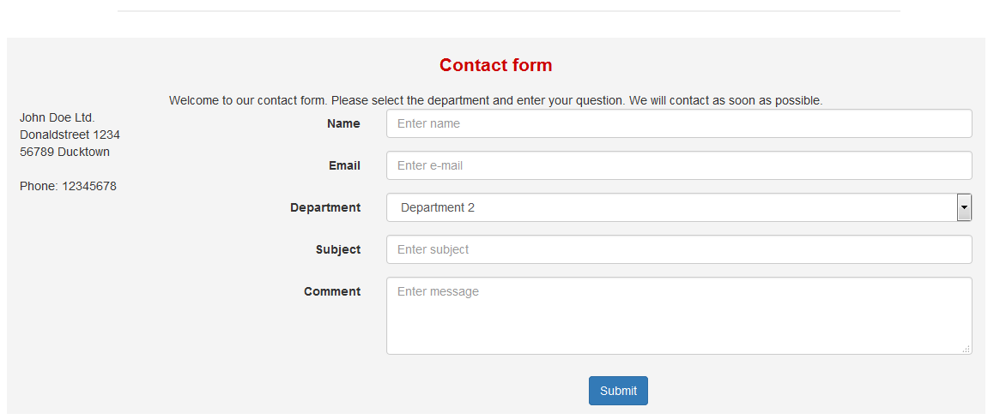
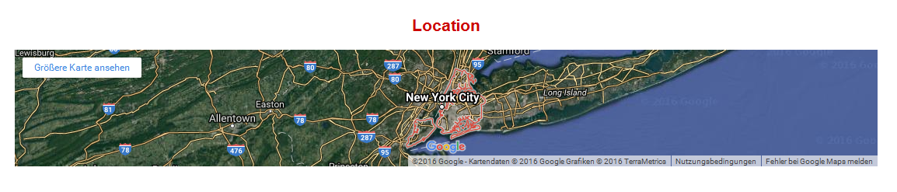
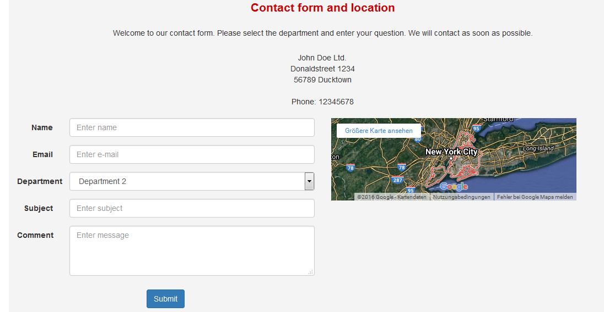

# 6.0 Blocks

Dieses Modul bietet folgende Blöcke:

#### 6.1 only contact form
This block display the contact form. If available, the header information text (see [preferences](3preferences.md)) will be placed on the top of the form. 
The default contact info (see also [preferences](3preferences.md)) will be displayed on the left side of the form, if available.
 

#### 6.2 only Google-Maps
If you have entered the data of a Google-Maps-iframe (see also [preferences](3preferences.md)), your selected location on the map will be shown in a block.
 

#### 6.3 contact form together with Google-Maps
This block display the contact form together with Google-Maps. The map will be placed on the right side.
 
