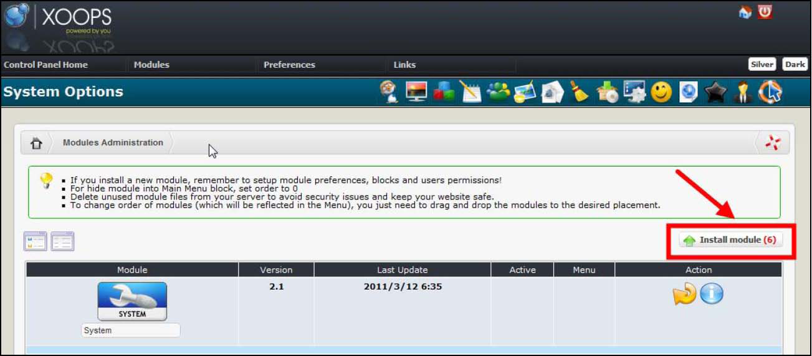

# Install/Uninstall

No special measures necessary, follow the standard installation process. Detailed instructions on installing modules are available in the [XOOPS Operations Manual](http://goo.gl/adT2i).

## 1.1 Install

* extract the module folder 'contact' into the /modules directory
* Log in as admin and goto Xoops Admin area
* Install the module through Admin -&gt; Modules -&gt; Install Modules

  

  _Figure: module administration and install_

* Configure the module 
* Set module and block permissions via System --&gt; Groups.

## 1.2 Uninstall

To uninstall the module, just click on the red arrow:  _Figure: Uninstalling in module administration_

