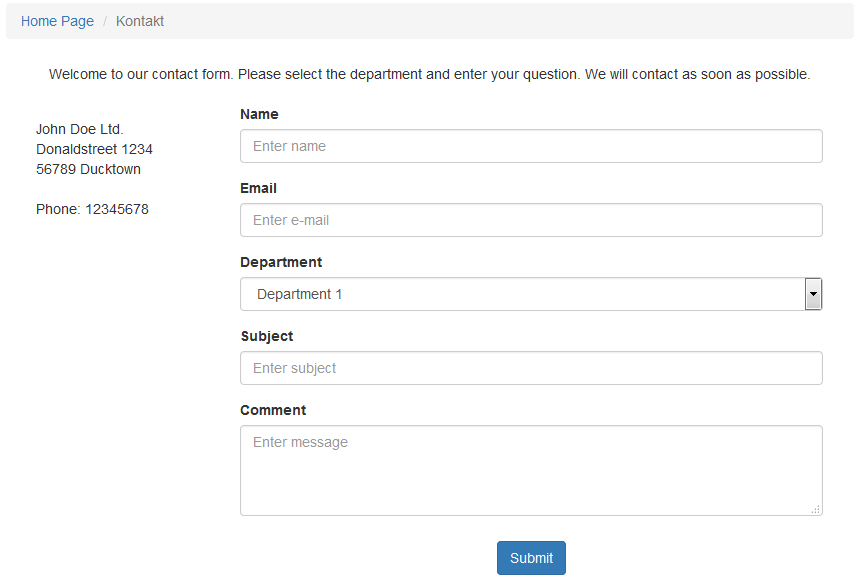
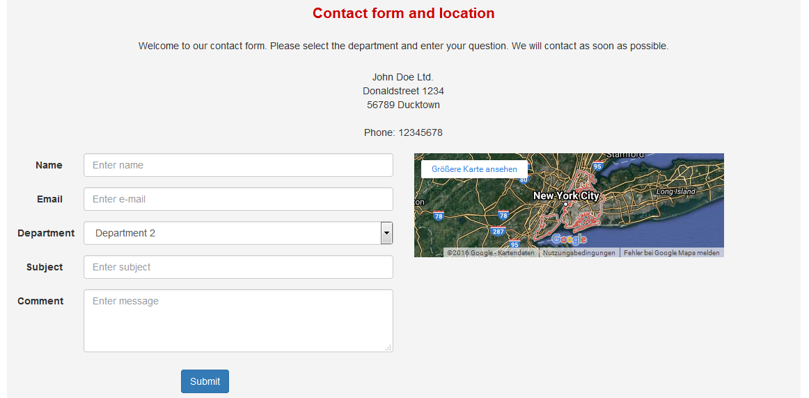

# The User Side

Users access the Contact Us form via a link in the main menu or it can be displayed in a block. They simply type their message into the “comments” section of the form and press the “submit” button to post it. If they are logged in the form will automatically be filled in with the contact details listed in their profile \(anonymous users must enter their details manually\). The welcome text \(see also [preferences 'Header contact form'](preferences.md)\) will be displayed on the top of the form. The default contact info \(see also [preferences](preferences.md)\) will be displayed on the left side of the form.  _Figure: User \(Front\) Side Form_

If you display the contact form in a block, you have three possibilities:

* only contact form
* only Google-Maps
* contact form together with Google-Maps

 _Figure: contact form together with Google-Maps as block on user side_

Additional information you can find at [blocks](blocks.md).

