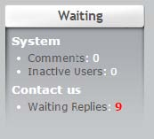

# Waiting Module Support

The Contact module includes native support for the Waiting module v0.97+. This support is enabled automatically and the Contact module will show up in the Waiting block: 

The Waiting module is available through XOOPS at [http://www.xoops.org](http://www.xoops.org).

**Note:** _The Waiting module is not the same as the XOOPS native \(core\) “Waiting Contents” block. The XOOPS core “Waiting Contents” block is not extensible and so contents from the Contact module will not be visible in this block._

The Contact module supplies information on messages which do not have a reply so site administrators can address any messages needing attention.

